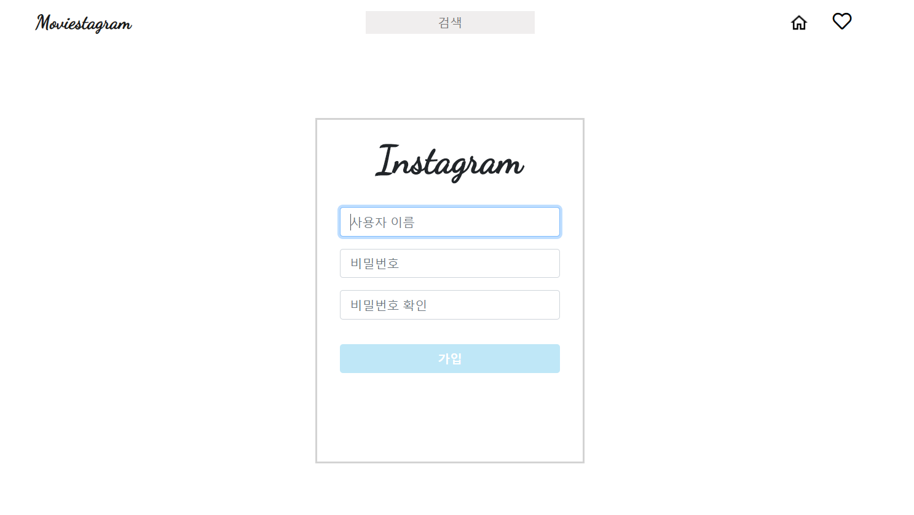
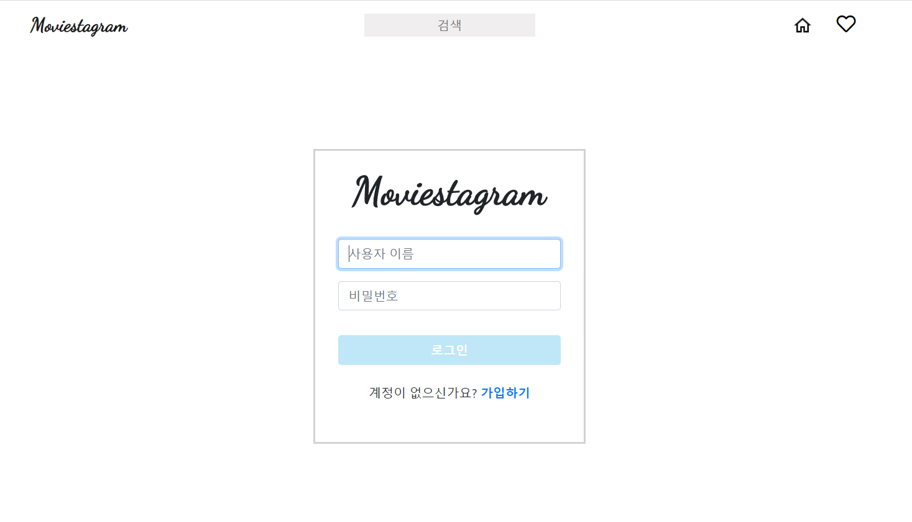
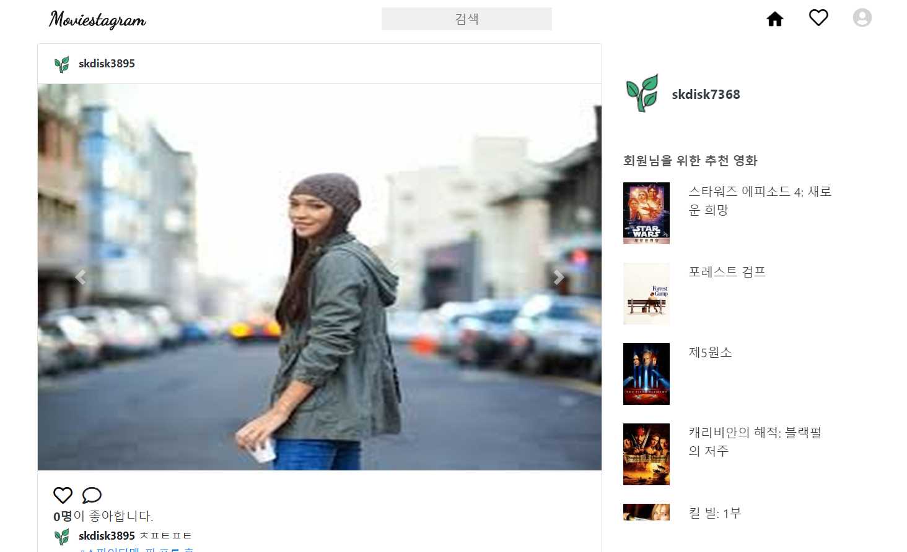
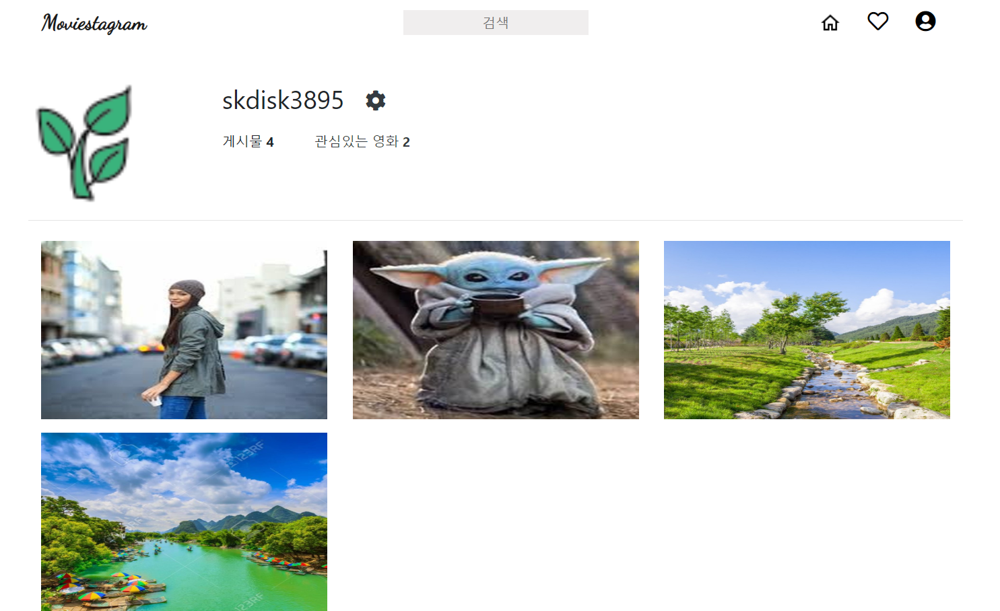
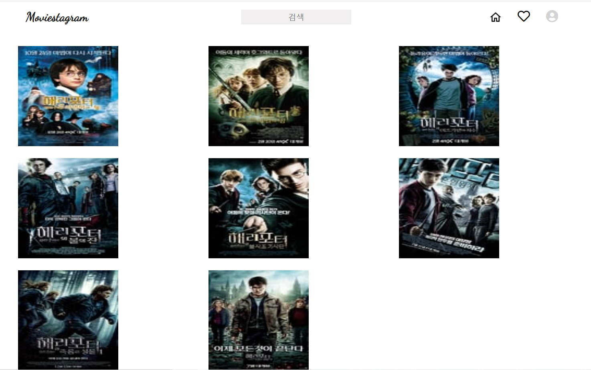
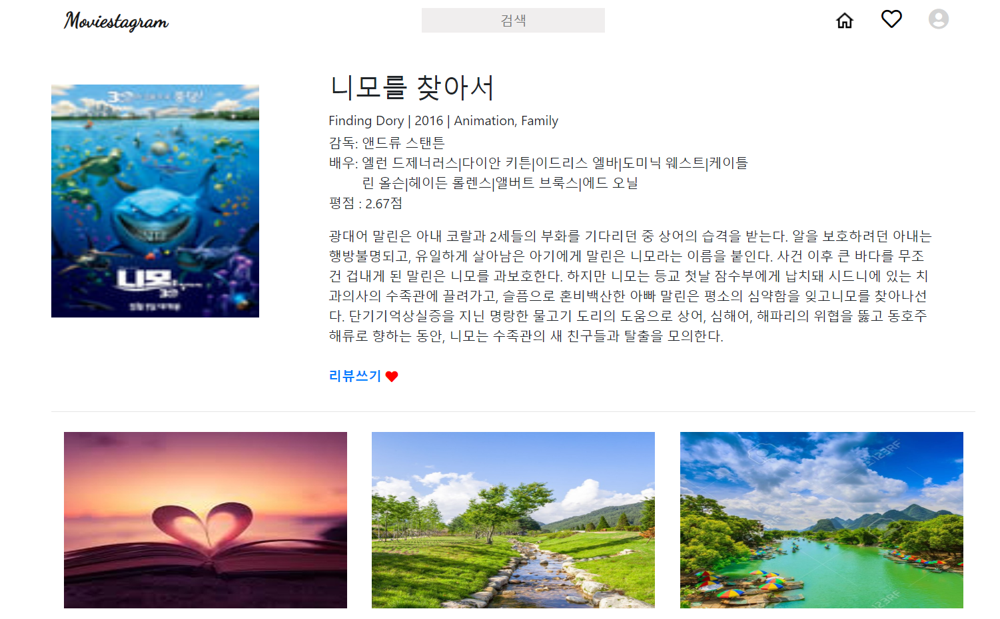
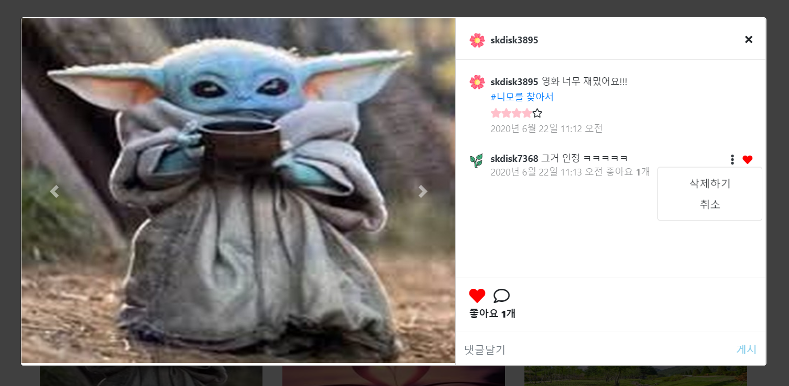

# Final Project Feedback(Moviestagram)

- 프로젝트 구조

  ```
  Moviestagram(master app)
  |
  |
  ├---- accounts - 계정 생성, 로그인, 로그아웃, 프로필
  |
  |
  ├---- home - 홈 화면
  |
  |
  ├---- movies - 관리자의 영화데이터 생성, 검색값에 따른 영화 리스트 출력 
  |
  |
  ├---- reviews - 각 영화에 대한 리뷰들, 리뷰 CRUD
  ```

- 결과물

  1. 회원가입

     

  2. 로그인

     

  3. 홈 화면

     

  4. 프로필

     

  5. 영화 검색 결과

     

  6. 영화 리뷰

     

  7. 리뷰 상세 페이지

     

     

- 어려웠던 점

  1. Model 구성

     프로젝트를 어떻게 설계를 해야할까에 대한 첫 시작을 `Model` 설계였다. 우리가 원하는 사이트를 만들기 위해 각 `Model`에 어떤 `attribute`를 넣어야 하는지에 대한 고민과 `Model`과 `Model`간의 관계가 어떻게 설정해야하는지에 대한 고민을 많이 했다. 그래서 우리는 `ERD`를 따로 구성할 수 있는 사이트에가서 깔끔하게 정리한 다음에 `Model`구성을 하고 코드구현하면서 필요한 `attribute`를 추가하면서 진행했다. (사실 이 방법이 좋은 습관인지 잘 모르겠다...) 

     

  2. 우리에게 닥쳐온 비동기 처리 방법(큰 위기였다...)

     우리가 `Django`를 배웠을 때, 상대적으로 동기식 처리 방법(`render`, `redirect`같이 새로고침이 발생하는 방식)에 대해 주로 배웠다보니 비동기 처리 방법에 대해 상당히 낯설었었다. 첫 회의를 끝나고 구현에 대해 두려워했던 것중 하나가 바로 비동기 처리 방법이었다. 왜냐하면 우리는 비동기 처리 방법인 자바스크립트 및 `JQuery`에 대한 지식이 너무나도 없었다.

     이러한 위기를 극복하기 위해 서로 밤을 세워가면서 공부를 했고, 겨우겨우 여러 비동기 처리 방식을 구현했다.

     

  3. `API`를 무엇을 써야할까? 에 대한 고민

     처음에 3가지 `API`(영화진흥위원회, naver, The Movie DB)의 data를 모두 분석해보았다.

     naver는 요청 변수에 장르가 없어서 탈락, 영화진흥위원회는 포스터가 없었다. 그래서 둘 다 만족하는 The Movie DB를 선택했다. 그러나 TMDB에는 영화에 대한 상세정보가 매우 부족했다.(감독, 개봉년도, 배우 등) 결국 우리는 naver API도 같이 사용을 했다.

  

- 배운 점

  1. 트랜젝션

     Django에서 View에서 create 관련 로직을 구현하는데 트랜젝션을 써봤다. 그 이유는 Review Form과 Image Form을 Formset 시켰는데, create view는 form을 2개를 써야만한다. 먼저 ReviewForm의 Validation이 완료가되면 Formset에 대한 Validation이 완료가 되어야하는데 Django는 DB의 응답을 기다려주지 않는다. 따라서 Formset이 Validation error 발생하던 안하던 코드를 계속 읽어내려가게 된다. 이러한 현상을 막아주는 것이 바로 Django에서 제공해주는 `transection.atomic`이다. atomic(원자성)은 간단하게 말하자면 '트랜젝션의 모든 연산을 한꺼번에 끝내야한다. 중간 오류 발생시 다 취소한다'라고 생각하면 된다.
     
  2. 데이터가 깊이 있을수록 성능이 떨어진다.
  
     View에서 context 안에 template에 써야만 하는 data를 넣는데, context안에 data를 이용하여 연결되어있는 model을 추적하게 되는데, 추적하는 깊이가 깊을수록 성능이 현저히 떨어진다. (유저 수가 10명이면 감당할 수 있겠지만 기하급수적으로 증가하면 심각한 문제가 될 거라고 생각한다.) 예를 들어서 User.like_movie.review.comment 이렇게 접근을 하면 3단계를 건너가야한다. 이렇게하면 매우 비효율적인 코드가 된다는 것이다. 가능하면 View에서 정리를 한 다음에 단계 수를 줄이는 것이 중요하다.